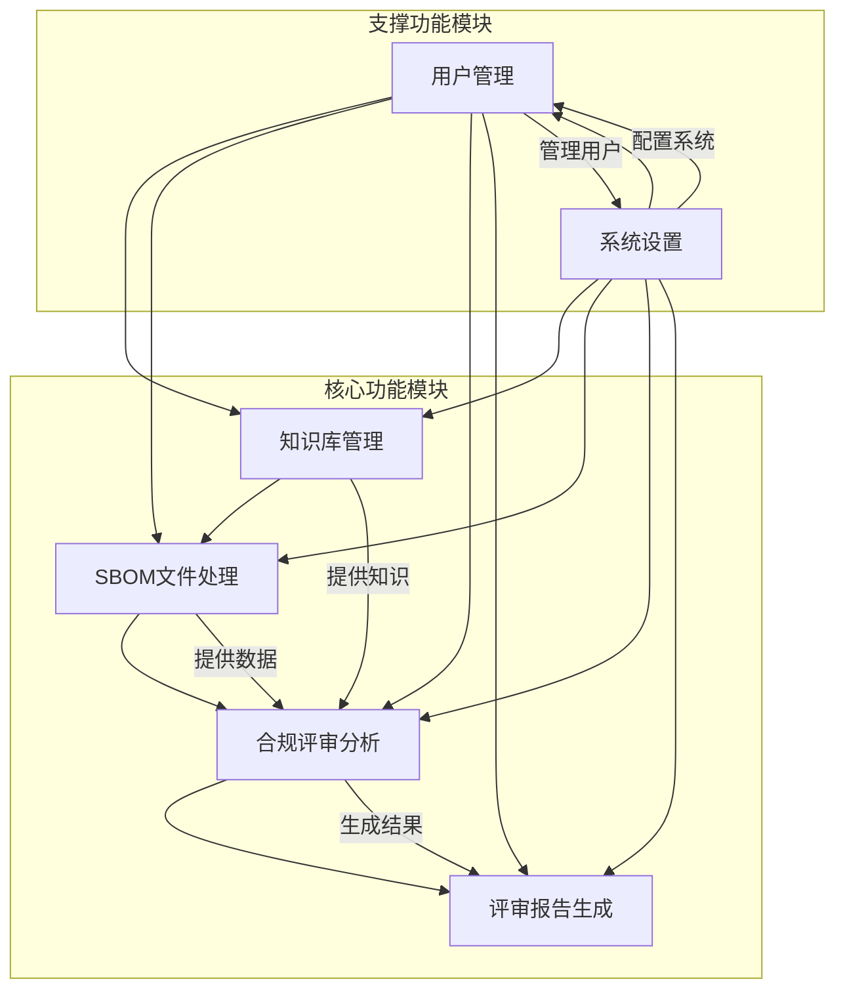
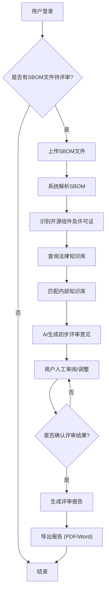
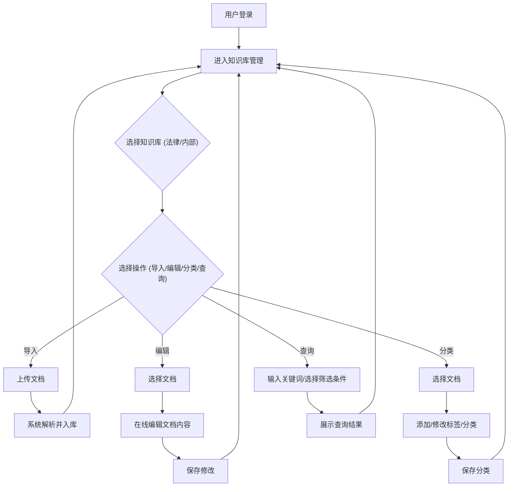
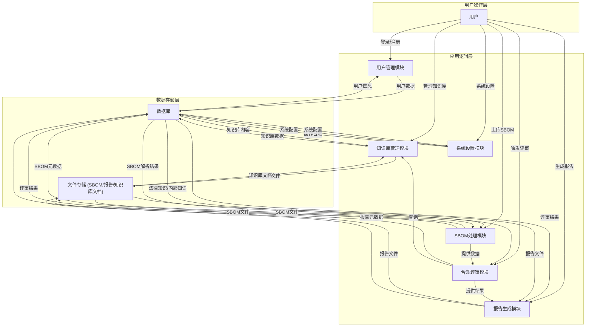

# 开源合规智能助手产品需求文档

## 1. 产品概述

### 1.1 产品名称与定位

- **产品名称:** 开源合规智能助手
- **产品定位:** 一款基于AI和双知识库（公开法律知识库与律师事务所内部知识库）的Web端开源合规评审平台，旨在为律师事务所提供高效、准确的开源软件合规性评审服务。

### 1.2 产品应用语言

- **产品应用语言:** 简体中文

### 1.3 产品愿景与目标

- **产品愿景:** 成为律师事务所进行开源合规评审的首选智能助手，通过AI技术赋能，提升评审效率和准确性，降低合规风险。
- **产品目标:**
  - 实现SBOM文件的自动化解析与开源组件识别。
  - 结合双知识库，提供全面、准确的合规风险识别和评审意见。
  - 支持标准化评审报告的自动生成与导出。
  - 提供便捷的知识库管理和用户权限控制功能。
  - 提升律师事务所内部知识共享和复用效率。

### 1.4 产品使用终端

- **主要终端:** Web端桌面应用
- **浏览器支持:** Chrome 90+、Firefox 88+、Safari 14+、Edge 90+
- **分辨率支持:** 768x480及以上分辨率，最佳体验为1920x1080
- **响应式适配:** 支持768px以上的所有桌面和平板设备。

### 1.5 核心价值主张

- **智能双知识库融合:** 结合公开法律知识与事务所内部专业经验，提供更具深度和针对性的评审意见。
- **自动化与效率提升:** 自动化SBOM解析、风险识别和报告生成，大幅减少人工操作，提高评审效率。
- **标准化与可追溯性:** 提供标准化的评审流程和报告模板，确保评审质量的一致性，并支持操作日志追溯。
- **风险预警与规避:** 提前识别开源组件潜在的合规风险，帮助事务所和客户规避法律纠纷。

### 1.6 目标用户群体分析

- **主要用户:**
  - **律师事务所合伙人/管理者:** 关注整体合规风险、团队效率和知识管理。
  - **合规律师/法务专员:** 直接进行开源合规评审工作，需要高效的工具和准确的法律依据。
  - **IT/技术支持人员:** 负责SBOM文件的上传、系统维护和数据管理。
- **用户特征:**
  - 对法律知识和技术细节有较高要求。
  - 注重工作效率和结果的准确性。
  - 对数据安全和隐私保护有严格要求。
  - 习惯使用Web端工具进行日常工作。

### 1.7 市场需求与竞品简析

- **市场需求:** 随着开源软件在企业中的广泛应用，开源合规性已成为企业和律师事务所面临的重要挑战。市场对自动化、智能化的开源合规评审工具需求日益增长，尤其是能够结合内部专业知识的解决方案。
- **竞品简析:**
  - **通用型AI知识库工具:** 提供知识库管理和问答功能，但缺乏针对开源合规的专业逻辑和SBOM处理能力。
  - **开源合规扫描工具:** 专注于SBOM解析和风险识别，但通常不具备深度法律知识库和专业律师事务所内部知识的融合能力。
  - **开源合规智能助手优势:** 专注于律师事务所场景，深度融合双知识库，提供从SBOM处理到专业评审报告生成的全流程解决方案，形成差异化竞争优势。

### 1.8 浏览器兼容性要求

- **桌面浏览器:**
  - Google Chrome (最新两个稳定版本)
  - Mozilla Firefox (最新两个稳定版本)
  - Microsoft Edge (最新两个稳定版本)
  - Apple Safari (最新两个稳定版本)
- **最低分辨率:** 1280x800px
- **推荐分辨率:** 1920x1080px 及以上

## 2. 功能规格

### 2.1 功能详述

#### 2.1.1 知识库管理

| 功能ID   | 功能名称     | 功能描述                                                                                                                                                                                       | 优先级 |
| -------- | ------------ | ---------------------------------------------------------------------------------------------------------------------------------------------------------------------------------------------- | ------ |
| F-KB_001 | 多知识库支持 | 支持创建和管理至少两个独立的知识库：一个用于存储公开的法律、法规、政策文件（法律知识库），另一个用于存储律师事务所内部的专业知识、案例、最佳实践（内部知识库）。每个知识库可独立配置访问权限。 | P0     |
| F-KB_002 | 文档导入     | 支持批量导入多种格式的文档（如PDF、Word、TXT、Markdown等）到指定知识库。系统自动解析文档内容并进行初步结构化处理，支持OCR识别图片中的文字。                                                    | P0     |
| F-KB_003 | 知识更新     | 提供知识库内容的增、删、改、查功能。支持对已导入文档进行在线编辑、版本管理和历史回溯。                                                                                                         | P0     |
| F-KB_004 | 知识分类     | 支持对知识库内容进行标签分类和层级结构组织。用户可自定义标签和分类体系，便于知识检索和管理。                                                                                                   | P0     |
| F-KB_005 | 知识库检索   | 提供全文检索功能，支持关键词搜索、按分类/标签筛选、按时间排序等，快速定位所需知识。                                                                                                            | P0     |

#### 2.1.2 SBOM文件处理

| 功能ID     | 功能名称 | 功能描述                                                                                                           | 优先级 |
| ---------- | -------- | ------------------------------------------------------------------------------------------------------------------ | ------ |
| F-SBOM_001 | 文件上传 | 支持用户上传各种主流格式的SBOM文件（如SPDX、CycloneDX、SWID等）。提供拖拽上传和点击上传两种方式。                  | P0     |
| F-SBOM_002 | SBOM解析 | 系统自动解析上传的SBOM文件，提取组件名称、版本、供应商、许可证信息、依赖关系等关键数据。                           | P0     |
| F-SBOM_003 | 组件识别 | 基于解析出的组件信息，自动识别开源组件及其对应的许可证类型。对于未知组件，提供人工标记和补充功能。                 | P0     |
| F-SBOM_004 | 文件历史 | 保存所有上传SBOM文件的历史记录，包括上传时间、上传人、文件版本等信息。支持查看历史版本的SBOM内容和对应的评审报告。 | P0     |

#### 2.1.3 合规评审分析

| 功能ID       | 功能名称       | 功能描述                                                                                                                   | 优先级 |
| ------------ | -------------- | -------------------------------------------------------------------------------------------------------------------------- | ------ |
| F-REVIEW_001 | 法律知识库查询 | 根据SBOM解析出的组件和许可证信息，自动检索法律知识库中相关的法律条款、政策要求和行业标准。                                 | P0     |
| F-REVIEW_002 | 内部知识库匹配 | 在法律知识库查询的基础上，结合事务所内部知识库，提供针对特定客户、行业或项目的专业指导、案例参考和内部最佳实践。           | P0     |
| F-REVIEW_003 | 合规风险识别   | 自动识别开源组件潜在的合规风险点，如许可证冲突、专利风险、版权问题、义务履行缺失等，并给出风险等级评估。                   | P0     |
| F-REVIEW_004 | 评审逻辑处理   | 评审逻辑严格遵循“先应用公开法规，再结合内部知识优化”的原则。系统根据预设规则和AI模型，综合双知识库信息，生成初步评审意见。 | P0     |
| F-REVIEW_005 | 人工干预与调整 | 提供界面供用户（律师）对AI生成的初步评审意见进行人工审阅、修改、补充和最终确认。                                           | P0     |

#### 2.1.4 评审报告生成

| 功能ID       | 功能名称 | 功能描述                                                                                                           | 优先级 |
| ------------ | -------- | ------------------------------------------------------------------------------------------------------------------ | ------ |
| F-REPORT_001 | 模板管理 | 提供标准化的评审意见文档模板库，支持用户创建、编辑和管理自定义模板。模板中可包含动态占位符，用于自动填充评审结果。 | P0     |
| F-REPORT_002 | 自动填充 | 根据最终确认的评审结果，自动将风险点、合规建议、法律依据等内容填充到选定的报告模板中。                             | P0     |
| F-REPORT_003 | 格式调整 | 支持对生成报告的基本格式进行调整，如字体、字号、颜色、段落样式等。提供所见即所得的编辑功能。                       | P0     |
| F-REPORT_004 | 文档导出 | 支持将生成的评审报告导出为PDF和Word格式，方便用户分享和归档。                                                      | P0     |

#### 2.1.5 用户管理

| 功能ID     | 功能名称     | 功能描述                                                                                                                                               | 优先级 |
| ---------- | ------------ | ------------------------------------------------------------------------------------------------------------------------------------------------------ | ------ |
| F-USER_001 | 用户注册     | 支持新用户通过注册页面进行账户注册，需填写必要的个人信息并设置密码。                                                                                   | P0     |
| F-USER_002 | 用户登录     | 提供安全的账户登录验证机制，支持用户名/邮箱和密码登录。                                                                                                | P0     |
| F-USER_003 | 角色权限     | 支持创建多种用户角色（如管理员、合规律师、普通用户、只读用户），并为不同角色分配精细化的操作权限，控制对知识库、SBOM文件、评审报告等资源的访问和操作。 | P0     |
| F-USER_004 | 个人资料     | 用户可查看和修改自己的个人资料，包括头像、昵称、联系方式等。支持修改登录密码。                                                                         | P0     |
| F-USER_005 | 用户列表管理 | 管理员可查看、编辑、禁用/启用所有用户账户，并管理用户角色分配。                                                                                        | P0     |

#### 2.1.6 系统设置

| 功能ID    | 功能名称 | 功能描述                                                                                                       | 优先级 |
| --------- | -------- | -------------------------------------------------------------------------------------------------------------- | ------ |
| F-SYS_001 | 基本配置 | 管理员可配置系统名称、Logo、联系方式等基础信息。                                                               | P0     |
| F-SYS_002 | 通知设置 | 配置系统通知方式，如评审完成通知、知识库更新通知等，支持邮件、站内信等方式。                                   | P0     |
| F-SYS_003 | 数据备份 | 提供系统数据定期自动备份功能，支持手动触发备份，并可配置备份存储路径和保留策略。                               | P0     |
| F-SYS_004 | 操作日志 | 记录用户的关键操作日志，包括登录、文件上传、知识库修改、评审报告生成等，确保操作可追溯性，便于审计和问题排查。 | P0     |

### 2.2 功能模块间的关系图

## 3. 用户流程

### 3.1 用户旅程地图

| 阶段           | 用户目标     | 用户行为                     | 系统响应                       | 痛点/机遇                   |
| -------------- | ------------ | ---------------------------- | ------------------------------ | --------------------------- |
| **登录/注册**  | 访问系统     | 输入账号密码/注册新账号      | 验证身份/创建账号              | 忘记密码/注册流程繁琐       |
| **SBOM上传**   | 提交评审材料 | 上传SBOM文件                 | 解析SBOM，提取组件信息         | 文件格式不兼容/解析失败     |
| **合规评审**   | 获取合规意见 | 查看AI初步评审结果，人工调整 | 展示风险点、法律依据、内部建议 | AI结果不准确/人工调整效率低 |
| **报告生成**   | 输出评审报告 | 选择模板，生成并导出报告     | 自动填充内容，生成PDF/Word     | 报告格式不符合要求/导出失败 |
| **知识库管理** | 维护知识体系 | 导入/编辑/分类知识文档       | 存储、索引、更新知识库         | 知识查找困难/更新不及时     |
| **系统设置**   | 配置系统参数 | 修改系统设置、管理用户       | 应用配置、更新用户状态         | 权限混乱/数据安全隐患       |

### 3.2 关键业务流程图

#### 3.2.1 SBOM合规评审主流程

#### 3.2.2 知识库管理流程

### 3.3 各场景下的用户操作步骤

#### 3.3.1 场景一：提交SBOM并获取评审报告

1.  **用户登录:** 用户在登录页（P-LOGIN）输入用户名和密码，点击“登录”按钮。
2.  **进入SBOM管理:** 登录成功后，系统跳转至首页（P-HOME），用户点击左侧菜单的“SBOM管理”进入SBOM列表页（P-SBOM_LIST）。
3.  **上传SBOM:** 在SBOM列表页（P-SBOM_LIST）点击“上传SBOM”按钮，弹出文件上传弹窗（P-SBOM_UPLOAD），用户选择SBOM文件并确认上传。
4.  **查看解析结果:** 文件上传成功后，系统自动解析SBOM并跳转至SBOM详情页（P-SBOM_DETAIL），展示解析出的组件列表和初步识别结果。
5.  **触发合规评审:** 在SBOM详情页（P-SBOM_DETAIL）点击“开始评审”按钮，系统开始执行合规评审分析。
6.  **人工审阅与调整:** 评审完成后，系统跳转至评审结果页（P-REVIEW_RESULT），用户查看AI生成的初步评审意见，并可进行人工修改、补充。
7.  **生成报告:** 用户确认评审结果无误后，点击“生成报告”按钮，弹出报告生成弹窗（P-REPORT_GENERATE），选择报告模板并确认生成。
8.  **导出报告:** 报告生成成功后，在报告生成弹窗（P-REPORT_GENERATE）点击“下载PDF”或“下载Word”按钮，将报告保存到本地。

#### 3.3.2 场景二：管理法律知识库

1.  **用户登录:** 用户在登录页（P-LOGIN）输入用户名和密码，点击“登录”按钮。
2.  **进入知识库管理:** 登录成功后，系统跳转至首页（P-HOME），用户点击左侧菜单的“知识库管理”进入知识库列表页（P-KB_LIST）。
3.  **选择法律知识库:** 在知识库列表页（P-KB_LIST）选择“法律知识库”，进入法律知识库详情页（P-KB_DETAIL）。
4.  **导入文档:** 在法律知识库详情页（P-KB_DETAIL）点击“导入文档”按钮，弹出文档导入弹窗（P-KB_IMPORT），用户选择本地文档并上传。
5.  **编辑文档:** 在法律知识库详情页（P-KB_DETAIL）的文档列表中，点击某个文档的“编辑”按钮，弹出文档编辑弹窗（P-KB_EDIT），用户修改文档内容并保存。
6.  **分类文档:** 在法律知识库详情页（P-KB_DETAIL）的文档列表中，选中一个或多个文档，点击“分类”按钮，弹出分类管理弹窗（P-KB_CATEGORY），用户选择或创建分类标签并应用。
7.  **搜索文档:** 在法律知识库详情页（P-KB_DETAIL）的搜索框中输入关键词，点击“搜索”按钮，系统展示匹配的文档列表。

## 4. 数据流设计

### 4.1 数据结构与关系

- **用户 (User):**
  - `UserID` (PK)
  - `Username`
  - `PasswordHash`
  - `Email`
  - `RoleID` (FK to Role)
  - `Status` (Active/Inactive)
  - `CreatedAt`
  - `UpdatedAt`
- **角色 (Role):**
  - `RoleID` (PK)
  - `RoleName` (Admin, Compliance Lawyer, User, Read-Only)
  - `Permissions` (JSON/Array of permission IDs)
- **知识库 (KnowledgeBase):**
  - `KBID` (PK)
  - `KBName` (e.g., "法律知识库", "内部知识库")
  - `Description`
  - `CreatorID` (FK to User)
  - `CreatedAt`
  - `UpdatedAt`
- **知识文档 (KnowledgeDocument):**
  - `DocID` (PK)
  - `KBID` (FK to KnowledgeBase)
  - `Title`
  - `Content` (Text/Markdown)
  - `OriginalFileName`
  - `FileType` (PDF, DOCX, TXT, etc.)
  - `UploaderID` (FK to User)
  - `CreatedAt`
  - `UpdatedAt`
  - `Version`
- **文档标签 (DocumentTag):**
  - `TagID` (PK)
  - `TagName`
  - `KBID` (FK to KnowledgeBase, optional for global tags)
- **文档-标签关联 (DocTagRelation):**
  - `DocID` (FK to KnowledgeDocument)
  - `TagID` (FK to DocumentTag)
- **SBOM文件 (SBOMFile):**
  - `SBOMID` (PK)
  - `FileName`
  - `OriginalFilePath`
  - `UploaderID` (FK to User)
  - `UploadTime`
  - `Status` (Uploaded, Parsed, Reviewing, Completed)
  - `Version`
- **SBOM组件 (SBOMComponent):**
  - `ComponentID` (PK)
  - `SBOMID` (FK to SBOMFile)
  - `ComponentName`
  - `Version`
  - `Supplier`
  - `LicenseID` (FK to License, if identified)
  - `Type` (e.g., Library, Framework)
  - `Description`
- **许可证 (License):**
  - `LicenseID` (PK)
  - `LicenseName` (e.g., MIT, Apache-2.0)
  - `SPDXIdentifier`
  - `Description`
  - `RiskLevel` (High, Medium, Low)
- **评审结果 (ReviewResult):**
  - `ReviewID` (PK)
  - `SBOMID` (FK to SBOMFile)
  - `ReviewerID` (FK to User)
  - `ReviewTime`
  - `Status` (Draft, Completed)
  - `RiskSummary` (Text)
  - `LegalBasis` (Text, references KnowledgeDocument)
  - `InternalGuidance` (Text, references KnowledgeDocument)
  - `FinalOpinion` (Text)
- **评审报告 (ReviewReport):**
  - `ReportID` (PK)
  - `ReviewID` (FK to ReviewResult)
  - `TemplateID` (FK to ReportTemplate)
  - `GeneratedTime`
  - `FilePath` (PDF/Word file path)
  - `FileName`
- **报告模板 (ReportTemplate):**
  - `TemplateID` (PK)
  - `TemplateName`
  - `Content` (Text with placeholders)
  - `CreatorID` (FK to User)
  - `CreatedAt`
  - `UpdatedAt`
- **操作日志 (OperationLog):**
  - `LogID` (PK)
  - `UserID` (FK to User)
  - `OperationType` (e.g., Login, UploadSBOM, EditKB)
  - `OperationDetails` (JSON)
  - `OperationTime`
  - `IPAddress`

### 4.2 关键数据流向图

### 4.3 数据存储与处理原则

1.  **数据安全:**
    - 所有敏感数据（如用户密码）进行加密存储。
    - 数据传输采用HTTPS加密协议。
    - 严格的访问控制和权限管理，确保只有授权用户才能访问相应数据。
    - 定期进行安全审计和漏洞扫描。
2.  **数据完整性:**
    - 采用数据库事务确保数据操作的原子性、一致性、隔离性和持久性。
    - 对关键数据字段进行数据类型校验和非空约束。
    - 定期进行数据一致性检查。
3.  **数据可追溯性:**
    - 记录所有关键操作日志，包括操作人、时间、操作类型和详情。
    - 知识库文档和SBOM文件支持版本管理，可回溯历史版本。
4.  **数据备份与恢复:**
    - 定期对数据库和文件存储进行全量和增量备份。
    - 制定详细的数据恢复计划，确保在数据丢失时能够快速恢复。
5.  **数据处理效率:**
    - 对知识库内容进行索引优化，提高检索效率。
    - SBOM解析和合规评审采用异步处理机制，避免阻塞用户操作。
    - 合理设计数据库索引和查询语句，优化数据读写性能。
6.  **数据隐私:**
    - 遵循相关数据隐私法规，保护用户和客户数据隐私。
    - 对敏感信息进行脱敏处理。

## 5. 页面规格

### 5.1 页面概览

#### 5.1.1 整体布局架构

- **布局模式:** Web端响应式布局 - 顶部导航栏 + 左侧菜单 + 主内容区。
- **空间分配策略:**
  - **顶部导航栏:** 固定高度60px，包含Logo、主要导航、用户操作区。
  - **左侧菜单:** 可折叠，展开宽度200-240px，折叠宽度48-56px。
  - **主内容区:** 动态宽度，占据剩余空间，最小宽度不低于720px。
  - **右侧面板:** **严格限制使用**，仅在屏幕宽度≥1440px且功能确实必要时使用，宽度280-320px。必须在布局中占据独立空间，绝对不能浮动遮挡主内容区，且需确保主内容区宽度≥720px。
- **导航体系:** 顶部主导航（用户相关操作）+ 左侧功能菜单（核心业务模块）+ 面包屑导航（辅助定位）。
- **交互模式:** 页面切换（通过左侧菜单）、模态弹窗（表单提交、确认操作）、侧边抽屉（详情查看）、右键菜单（快捷操作）。

#### 5.1.2 页面列表

| 页面ID            | 页面名称     | 核心功能                   | 布局类型 | 右侧面板                  |
| ----------------- | ------------ | -------------------------- | -------- | ------------------------- |
| P-LOGIN           | 登录页       | 用户登录                   | 单栏居中 | 不使用                    |
| P-REGISTER        | 注册页       | 用户注册                   | 单栏居中 | 不使用                    |
| P-HOME            | 首页         | 系统概览、快速入口         | 二栏布局 | 慎用(仅在≥1440px且必要时) |
| P-SBOM_LIST       | SBOM管理页   | SBOM文件列表、上传、历史   | 二栏布局 | 不使用                    |
| P-SBOM_DETAIL     | SBOM详情页   | SBOM解析结果、组件列表     | 二栏布局 | 慎用(仅在≥1440px且必要时) |
| P-REVIEW_RESULT   | 评审结果页   | AI评审意见、人工调整       | 二栏布局 | 慎用(仅在≥1440px且必要时) |
| P-REPORT_LIST     | 报告列表页   | 已生成报告列表、下载       | 二栏布局 | 不使用                    |
| P-KB_LIST         | 知识库列表页 | 知识库选择、概览           | 二栏布局 | 不使用                    |
| P-KB_DETAIL       | 知识库详情页 | 知识文档列表、管理         | 二栏布局 | 慎用(仅在≥1440px且必要时) |
| P-USER_MANAGE     | 用户管理页   | 用户列表、角色权限管理     | 二栏布局 | 不使用                    |
| P-SYS_SETTINGS    | 系统设置页   | 系统配置、通知、备份、日志 | 二栏布局 | 不使用                    |
| P-PROFILE         | 个人资料页   | 用户个人信息、密码修改     | 二栏布局 | 不使用                    |
| P-SBOM_UPLOAD     | SBOM上传弹窗 | SBOM文件上传               | 模态弹窗 | 不适用                    |
| P-KB_IMPORT       | 文档导入弹窗 | 知识库文档批量导入         | 模态弹窗 | 不适用                    |
| P-KB_EDIT         | 文档编辑弹窗 | 知识库文档在线编辑         | 模态弹窗 | 不适用                    |
| P-KB_CATEGORY     | 分类管理弹窗 | 知识库文档分类与标签管理   | 模态弹窗 | 不适用                    |
| P-REPORT_GENERATE | 报告生成弹窗 | 评审报告生成与导出         | 模态弹窗 | 不适用                    |
| P-USER_EDIT       | 用户编辑弹窗 | 用户信息与角色编辑         | 模态弹窗 | 不适用                    |
| P-ROLE_MANAGE     | 角色管理弹窗 | 角色创建与权限配置         | 模态弹窗 | 不适用                    |

### 5.2 页面详情

#### 5.2.1 登录页（P-LOGIN）

**布局架构设计：**

- 页面类型：认证页面
- 布局模式：单栏居中布局
- 空间分配：登录表单区域居中显示，背景为系统品牌元素或简洁设计。

**页面布局架构：**

- 顶部导航栏：无
- 左侧菜单：无
- 主内容区域：
  - 登录表单：包含用户名/邮箱输入框、密码输入框、登录按钮、忘记密码链接、注册链接。
  - 品牌Logo和产品名称。

**响应式适配策略：**

- 大屏幕(≥1440px)：登录表单区域固定宽度（如400px），居中显示。
- 中屏幕(1200-1439px)：登录表单区域固定宽度，居中显示。
- 小屏幕(768-1199px)：登录表单区域宽度自适应，最大宽度限制，居中显示。
- 移动端(<768px)：登录表单区域宽度充满屏幕，上下边距保留。

**组件尺寸规范：**

- 按钮尺寸：登录按钮高度40px，宽度充满表单区域。
- 输入框：高度40px，宽度充满表单区域。
- 间距规范：输入框间距16px，按钮与输入框间距24px。

**核心功能：**
用户身份验证，允许用户登录系统。

#### 5.2.2 注册页（P-REGISTER）

**布局架构设计：**

- 页面类型：认证页面
- 布局模式：单栏居中布局
- 空间分配：注册表单区域居中显示，背景为系统品牌元素或简洁设计。

**页面布局架构：**

- 顶部导航栏：无
- 左侧菜单：无
- 主内容区域：
  - 注册表单：包含用户名输入框、邮箱输入框、密码输入框、确认密码输入框、注册按钮、已有账号登录链接。
  - 品牌Logo和产品名称。

**响应式适配策略：**

- 大屏幕(≥1440px)：注册表单区域固定宽度（如400px），居中显示。
- 中屏幕(1200-1439px)：注册表单区域固定宽度，居中显示。
- 小屏幕(768-1199px)：注册表单区域宽度自适应，最大宽度限制，居中显示。
- 移动端(<768px)：注册表单区域宽度充满屏幕，上下边距保留。

**组件尺寸规范：**

- 按钮尺寸：注册按钮高度40px，宽度充满表单区域。
- 输入框：高度40px，宽度充满表单区域。
- 间距规范：输入框间距16px，按钮与输入框间距24px。

**核心功能：**
新用户账户注册，允许用户创建新的系统账户。

#### 5.2.3 首页（P-HOME）

**布局架构设计：**

- 页面类型：概览页面
- 布局模式：二栏布局，可选三栏（仅在屏幕宽度≥1440px且必要时）
- 空间分配：顶部导航栏 + 左侧菜单 + 主内容区。主内容区可包含概览卡片、快捷入口、最近活动等。

**页面布局架构：**

- 顶部导航栏：Logo、全局搜索框、消息通知、用户头像（点击进入个人资料页） - 建议高度60px，固定定位。
- 左侧菜单：功能导航菜单（如SBOM管理、知识库管理、报告列表、用户管理、系统设置），当前选中"首页"，支持折叠 - 建议宽度200-240px(展开)/48-56px(折叠)。
- 主内容区域：核心展示区域，建议最小宽度720px。
  - 页面头部：欢迎信息、面包屑导航（首页） - 建议高度48-60px。
  - 概览卡片区：展示关键数据概览，如待处理SBOM数量、已完成评审数量、知识库文档总数等，可采用多列布局。
  - 快捷入口区：提供常用功能的快捷操作按钮，如“上传SBOM”、“新建知识库”等。
  - 最近活动/通知区：展示用户最近的操作记录或系统通知。
- 右侧面板：**慎用**：仅在屏幕宽度≥1440px且功能确实必要时使用，辅助功能区域，宽度280-320px。**严格要求：在布局中占据独立空间，绝对不能遮挡主内容，且需确保主内容区宽度≥720px。**
  - 推荐内容：相关推荐、热门内容等（非关键信息）。
  - 操作面板：快速操作、工具栏等（非核心功能）。
  - 信息展示：统计信息、状态显示等（必须在主内容区有完整替代方案）。

**响应式适配策略：**

- 大屏幕(≥1440px)：二栏布局，仅在功能确实必要时考虑三栏布局，如使用三栏，左侧200-240px + 主内容区(≥720px) + 右侧280-320px（所有面板均占据布局空间，严禁遮挡）。
- 中屏幕(1200-1439px)：二栏布局，**严禁使用右侧面板**，主内容区充满剩余空间。
- 小屏幕(768-1199px)：左侧菜单折叠或抽屉式，内容改为2列布局（抽屉式菜单需用户主动触发）。
- 移动端(<768px)：单栏布局，内容单列显示，保持核心功能（所有侧边面板均隐藏或抽屉化）。

**组件尺寸规范：**

- 按钮尺寸：主要操作按钮36px高度，次要按钮32px高度。
- 输入框：全局搜索框36px高度。
- 概览卡片：建议最小高度120px，宽度自适应，最小200px。
- 间距规范：卡片间距16px，区域间距20px，组件内间距12px。

**核心功能：**
系统概览、快速导航、待办事项提醒、最近活动展示。

#### 5.2.4 SBOM管理页（P-SBOM_LIST）

**布局架构设计：**

- 页面类型：列表管理页面
- 布局模式：二栏布局
- 空间分配：顶部导航栏 + 左侧菜单 + 主内容区。主内容区包含SBOM文件列表、搜索筛选、上传按钮。

**页面布局架构：**

- 顶部导航栏：同首页（P-HOME）。
- 左侧菜单：同首页（P-HOME），当前选中"SBOM管理"。
- 主内容区域：核心展示区域，建议最小宽度720px。
  - 页面头部：页面标题“SBOM管理”、面包屑导航、主要操作按钮组（如“上传SBOM”） - 建议高度48-60px。
  - 工具栏区域：搜索框（按文件名、上传人）、筛选条件（按状态、上传时间范围）、批量操作按钮（如批量删除） - 建议高度40-48px。
  - 内容展示区域：SBOM文件列表，以表格形式展示。
  - 分页区域：分页控件，显示总数、每页条数选择、跳转功能 - 建议高度40px。

**响应式适配策略：**

- 大屏幕(≥1440px)：二栏布局，主内容区充分利用空间。
- 中屏幕(1200-1439px)：二栏布局，主内容区充满剩余空间。
- 小屏幕(768-1199px)：左侧菜单折叠或抽屉式，表格列可隐藏部分非关键信息，或支持横向滚动。
- 移动端(<768px)：单栏布局，表格转换为卡片列表或仅显示关键信息，支持横向滚动。

**组件尺寸规范：**

- 按钮尺寸：上传SBOM按钮高度36px，表格内操作按钮28px。
- 输入框：搜索框高度36px。
- 表格行高：36px。
- 间距规范：工具栏组件间距12px，区域间距16px。

**核心功能：**
SBOM文件的上传、列表展示、搜索、筛选、批量操作和历史记录查看。

**数据结构：**
| 列名 | 数据类型 | 宽度建议 | 是否可排序 | 操作功能 |
|------|---------|----------|----------|---------|
| 复选框 | 布尔值 | 40px | 否 | 多选 |
| 文件名称 | 文本 | 200px | 是 | 点击查看详情 |
| 上传人 | 文本 | 120px | 是 | - |
| 上传时间 | 日期时间 | 160px | 是 | - |
| 状态 | 标签 | 100px | 是 | - |
| 版本 | 文本 | 80px | 否 | - |
| 操作 | 操作按钮组 | 150px | 否 | 查看详情/删除/重新评审 |

#### 5.2.5 SBOM详情页（P-SBOM_DETAIL）

**布局架构设计：**

- 页面类型：详情展示页面
- 布局模式：二栏布局，可选三栏（仅在屏幕宽度≥1440px且必要时）
- 空间分配：顶部导航栏 + 左侧菜单 + 主内容区。主内容区展示SBOM文件基本信息和解析出的组件列表。

**页面布局架构：**

- 顶部导航栏：同首页（P-HOME）。
- 左侧菜单：同首页（P-HOME），当前选中"SBOM管理"。
- 主内容区域：核心展示区域，建议最小宽度720px。
  - 页面头部：页面标题“SBOM详情”、面包屑导航、主要操作按钮组（如“开始评审”、“下载原始SBOM”） - 建议高度48-60px。
  - SBOM基本信息区：展示文件名、上传人、上传时间、状态、版本等。
  - 组件列表区：以表格形式展示解析出的开源组件列表，包含组件名称、版本、许可证、供应商等信息。
  - 分页区域：组件列表分页控件 - 建议高度40px。
- 右侧面板：**慎用**：仅在屏幕宽度≥1440px且功能确实必要时使用，辅助功能区域，宽度280-320px。**严格要求：在布局中占据独立空间，绝对不能遮挡主内容，且需确保主内容区宽度≥720px。**
  - 组件统计：按许可证类型、风险等级等统计组件数量。
  - 相关操作：如“开始评审”、“查看历史评审”等快捷入口。

**响应式适配策略：**

- 大屏幕(≥1440px)：二栏布局，仅在功能确实必要时考虑三栏布局，如使用三栏，左侧200-240px + 主内容区(≥720px) + 右侧280-320px（所有面板均占据布局空间，严禁遮挡）。
- 中屏幕(1200-1439px)：二栏布局，**严禁使用右侧面板**，主内容区充满剩余空间。
- 小屏幕(768-1199px)：左侧菜单折叠或抽屉式，表格列可隐藏部分非关键信息，或支持横向滚动。
- 移动端(<768px)：单栏布局，表格转换为卡片列表或仅显示关键信息，支持横向滚动。

**组件尺寸规范：**

- 按钮尺寸：开始评审按钮高度36px，表格内操作按钮28px。
- 表格行高：36px。
- 间距规范：区域间距16px，组件间距12px。

**核心功能：**
展示SBOM文件的详细信息和解析出的组件列表，提供开始评审的入口。

**数据结构：**
| 列名 | 数据类型 | 宽度建议 | 是否可排序 | 操作功能 |
|------|---------|----------|----------|---------|
| 组件名称 | 文本 | 200px | 是 | - |
| 版本 | 文本 | 100px | 否 | - |
| 许可证 | 文本 | 150px | 是 | - |
| 供应商 | 文本 | 150px | 是 | - |
| 类型 | 文本 | 80px | 否 | - |
| 描述 | 文本 | 250px | 否 | - |

#### 5.2.6 评审结果页（P-REVIEW_RESULT）

**布局架构设计：**

- 页面类型：结果展示与编辑页面
- 布局模式：二栏布局，可选三栏（仅在屏幕宽度≥1440px且必要时）
- 空间分配：顶部导航栏 + 左侧菜单 + 主内容区。主内容区展示AI生成的评审意见和人工调整区域。

**页面布局架构：**

- 顶部导航栏：同首页（P-HOME）。
- 左侧菜单：同首页（P-HOME），当前选中"SBOM管理"。
- 主内容区域：核心展示区域，建议最小宽度720px。
  - 页面头部：页面标题“评审结果”、面包屑导航、主要操作按钮组（如“生成报告”、“重新评审”） - 建议高度48-60px。
  - 评审概览区：总结性的风险等级、主要风险点概述。
  - AI评审意见区：展示AI根据双知识库生成的初步评审意见，包括法律依据、内部指导、风险识别等。
  - 人工调整区：提供富文本编辑器，允许用户对AI评审意见进行修改、补充和最终确认。
  - 评审日志/历史区：展示该SBOM的评审历史记录。
- 右侧面板：**慎用**：仅在屏幕宽度≥1440px且功能确实必要时使用，辅助功能区域，宽度280-320px。**严格要求：在布局中占据独立空间，绝对不能遮挡主内容，且需确保主内容区宽度≥720px。**
  - 相关法律条款：快速链接到法律知识库中引用的条款。
  - 相关内部知识：快速链接到内部知识库中引用的指导。
  - 风险点详情：可展开查看每个风险点的详细说明。

**响应式适配策略：**

- 大屏幕(≥1440px)：二栏布局，仅在功能确实必要时考虑三栏布局，如使用三栏，左侧200-240px + 主内容区(≥720px) + 右侧280-320px（所有面板均占据布局空间，严禁遮挡）。
- 中屏幕(1200-1439px)：二栏布局，**严禁使用右侧面板**，主内容区充满剩余空间。
- 小屏幕(768-1199px)：左侧菜单折叠或抽屉式，内容区域垂直堆叠，编辑器自适应。
- 移动端(<768px)：单栏布局，内容区域垂直堆叠，编辑器自适应。

**组件尺寸规范：**

- 按钮尺寸：生成报告按钮高度36px。
- 富文本编辑器：高度自适应，最小高度400px。
- 间距规范：区域间距16px，组件间距12px。

**核心功能：**
展示AI生成的初步评审意见，允许用户进行人工审阅、修改和最终确认，并提供生成报告的入口。

#### 5.2.7 报告列表页（P-REPORT_LIST）

**布局架构设计：**

- 页面类型：列表管理页面
- 布局模式：二栏布局
- 空间分配：顶部导航栏 + 左侧菜单 + 主内容区。主内容区包含已生成报告列表、搜索筛选、下载功能。

**页面布局架构：**

- 顶部导航栏：同首页（P-HOME）。
- 左侧菜单：同首页（P-HOME），当前选中"报告列表"。
- 主内容区域：核心展示区域，建议最小宽度720px。
  - 页面头部：页面标题“报告列表”、面包屑导航 - 建议高度48-60px。
  - 工具栏区域：搜索框（按报告名称、关联SBOM）、筛选条件（按生成时间范围、生成人） - 建议高度40-48px。
  - 内容展示区域：已生成报告列表，以表格形式展示。
  - 分页区域：分页控件，显示总数、每页条数选择、跳转功能 - 建议高度40px。

**响应式适配策略：**

- 大屏幕(≥1440px)：二栏布局，主内容区充分利用空间。
- 中屏幕(1200-1439px)：二栏布局，主内容区充满剩余空间。
- 小屏幕(768-1199px)：左侧菜单折叠或抽屉式，表格列可隐藏部分非关键信息，或支持横向滚动。
- 移动端(<768px)：单栏布局，表格转换为卡片列表或仅显示关键信息，支持横向滚动。

**组件尺寸规范：**

- 按钮尺寸：表格内下载按钮28px。
- 输入框：搜索框高度36px。
- 表格行高：36px。
- 间距规范：工具栏组件间距12px，区域间距16px。

**核心功能：**
展示所有已生成的评审报告，支持搜索、筛选和下载。

**数据结构：**
| 列名 | 数据类型 | 宽度建议 | 是否可排序 | 操作功能 |
|------|---------|----------|----------|---------|
| 报告名称 | 文本 | 250px | 是 | - |
| 关联SBOM | 文本 | 200px | 是 | 点击查看SBOM详情 |
| 生成人 | 文本 | 120px | 是 | - |
| 生成时间 | 日期时间 | 160px | 是 | - |
| 格式 | 文本 | 80px | 否 | - |
| 操作 | 操作按钮组 | 100px | 否 | 下载/删除 |

#### 5.2.8 知识库列表页（P-KB_LIST）

**布局架构设计：**

- 页面类型：列表管理页面
- 布局模式：二栏布局
- 空间分配：顶部导航栏 + 左侧菜单 + 主内容区。主内容区展示所有知识库的列表和概览。

**页面布局架构：**

- 顶部导航栏：同首页（P-HOME）。
- 左侧菜单：同首页（P-HOME），当前选中"知识库管理"。
- 主内容区域：核心展示区域，建议最小宽度720px。
  - 页面头部：页面标题“知识库管理”、面包屑导航、主要操作按钮组（如“新建知识库”） - 建议高度48-60px。
  - 内容展示区域：知识库列表，以卡片或表格形式展示，包含知识库名称、描述、文档数量、创建人、最后更新时间等。
  - 分页区域：如果知识库数量多，可包含分页控件 - 建议高度40px。

**响应式适配策略：**

- 大屏幕(≥1440px)：二栏布局，主内容区充分利用空间。
- 中屏幕(1200-1439px)：二栏布局，主内容区充满剩余空间。
- 小屏幕(768-1199px)：左侧菜单折叠或抽屉式，卡片或表格布局自适应。
- 移动端(<768px)：单栏布局，卡片或表格布局自适应。

**组件尺寸规范：**

- 按钮尺寸：新建知识库按钮高度36px。
- 卡片尺寸：高度自适应，宽度根据列数自适应。
- 间距规范：卡片间距16px，区域间距16px。

**核心功能：**
展示所有可用的知识库，提供进入知识库详情的入口。

**数据结构：**
| 列名 | 数据类型 | 宽度建议 | 是否可排序 | 操作功能 |
|------|---------|----------|----------|---------|
| 知识库名称 | 文本 | 200px | 是 | 点击进入详情 |
| 描述 | 文本 | 300px | 否 | - |
| 文档数量 | 数字 | 100px | 是 | - |
| 创建人 | 文本 | 120px | 是 | - |
| 最后更新 | 日期时间 | 160px | 是 | - |
| 操作 | 操作按钮组 | 100px | 否 | 编辑/删除 |

#### 5.2.9 知识库详情页（P-KB_DETAIL）

**布局架构设计：**

- 页面类型：列表管理页面
- 布局模式：二栏布局，可选三栏（仅在屏幕宽度≥1440px且必要时）
- 空间分配：顶部导航栏 + 左侧菜单 + 主内容区。主内容区展示选定知识库的文档列表和管理功能。

**页面布局架构：**

- 顶部导航栏：同首页（P-HOME）。
- 左侧菜单：同首页（P-HOME），当前选中"知识库管理"。
- 主内容区域：核心展示区域，建议最小宽度720px。
  - 页面头部：页面标题“知识库名称”、面包屑导航、主要操作按钮组（如“导入文档”、“新建文档”） - 建议高度48-60px。
  - 工具栏区域：搜索框（按文档标题、内容）、筛选条件（按标签、上传时间范围）、批量操作按钮（如批量删除、批量分类） - 建议高度40-48px。
  - 内容展示区域：知识库文档列表，以表格形式展示。
  - 分页区域：分页控件，显示总数、每页条数选择、跳转功能 - 建议高度40px。
- 右侧面板：**慎用**：仅在屏幕宽度≥1440px且功能确实必要时使用，辅助功能区域，宽度280-320px。**严格要求：在布局中占据独立空间，绝对不能遮挡主内容，且需确保主内容区宽度≥720px。**
  - 标签云：显示当前知识库中常用标签，点击可筛选文档。
  - 文档统计：按文件类型、标签等统计文档数量。
  - 最近更新：显示最近更新的文档列表。

**响应式适配策略：**

- 大屏幕(≥1440px)：二栏布局，仅在功能确实必要时考虑三栏布局，如使用三栏，左侧200-240px + 主内容区(≥720px) + 右侧280-320px（所有面板均占据布局空间，严禁遮挡）。
- 中屏幕(1200-1439px)：二栏布局，**严禁使用右侧面板**，主内容区充满剩余空间。
- 小屏幕(768-1199px)：左侧菜单折叠或抽屉式，表格列可隐藏部分非关键信息，或支持横向滚动。
- 移动端(<768px)：单栏布局，表格转换为卡片列表或仅显示关键信息，支持横向滚动。

**组件尺寸规范：**

- 按钮尺寸：导入文档按钮高度36px，表格内操作按钮28px。
- 输入框：搜索框高度36px。
- 表格行高：36px。
- 间距规范：工具栏组件间距12px，区域间距16px。

**核心功能：**
管理特定知识库内的文档，包括导入、编辑、分类、搜索和删除。

**数据结构：**
| 列名 | 数据类型 | 宽度建议 | 是否可排序 | 操作功能 |
|------|---------|----------|----------|---------|
| 复选框 | 布尔值 | 40px | 否 | 多选 |
| 文档标题 | 文本 | 300px | 是 | 点击查看详情/编辑 |
| 标签 | 标签组 | 200px | 否 | - |
| 上传人 | 文本 | 120px | 是 | - |
| 上传时间 | 日期时间 | 160px | 是 | - |
| 文件类型 | 文本 | 80px | 否 | - |
| 操作 | 操作按钮组 | 150px | 否 | 编辑/删除/分类 |

#### 5.2.10 用户管理页（P-USER_MANAGE）

**布局架构设计：**

- 页面类型：列表管理页面
- 布局模式：二栏布局
- 空间分配：顶部导航栏 + 左侧菜单 + 主内容区。主内容区包含用户列表、搜索筛选、用户编辑功能。

**页面布局架构：**

- 顶部导航栏：同首页（P-HOME）。
- 左侧菜单：同首页（P-HOME），当前选中"用户管理"。
- 主内容区域：核心展示区域，建议最小宽度720px。
  - 页面头部：页面标题“用户管理”、面包屑导航、主要操作按钮组（如“新建用户”、“角色管理”） - 建议高度48-60px。
  - 工具栏区域：搜索框（按用户名、邮箱）、筛选条件（按角色、状态）、批量操作按钮（如批量禁用/启用） - 建议高度40-48px。
  - 内容展示区域：用户列表，以表格形式展示。
  - 分页区域：分页控件，显示总数、每页条数选择、跳转功能 - 建议高度40px。

**响应式适配策略：**

- 大屏幕(≥1440px)：二栏布局，主内容区充分利用空间。
- 中屏幕(1200-1439px)：二栏布局，主内容区充满剩余空间。
- 小屏幕(768-1199px)：左侧菜单折叠或抽屉式，表格列可隐藏部分非关键信息，或支持横向滚动。
- 移动端(<768px)：单栏布局，表格转换为卡片列表或仅显示关键信息，支持横向滚动。

**组件尺寸规范：**

- 按钮尺寸：新建用户按钮高度36px，表格内操作按钮28px。
- 输入框：搜索框高度36px。
- 表格行高：36px。
- 间距规范：工具栏组件间距12px，区域间距16px。

**核心功能：**
管理系统用户账户，包括创建、编辑、禁用/启用、分配角色。

**数据结构：**
| 列名 | 数据类型 | 宽度建议 | 是否可排序 | 操作功能 |
|------|---------|----------|----------|---------|
| 复选框 | 布尔值 | 40px | 否 | 多选 |
| 用户名 | 文本 | 150px | 是 | - |
| 邮箱 | 文本 | 200px | 是 | - |
| 角色 | 文本 | 120px | 是 | - |
| 状态 | 标签 | 80px | 是 | - |
| 创建时间 | 日期时间 | 160px | 是 | - |
| 操作 | 操作按钮组 | 150px | 否 | 编辑/禁用/启用/重置密码 |

#### 5.2.11 系统设置页（P-SYS_SETTINGS）

**布局架构设计：**

- 页面类型：配置页面
- 布局模式：二栏布局
- 空间分配：顶部导航栏 + 左侧菜单 + 主内容区。主内容区包含系统各项配置的表单或列表。

**页面布局架构：**

- 顶部导航栏：同首页（P-HOME）。
- 左侧菜单：同首页（P-HOME），当前选中"系统设置"。
- 主内容区域：核心展示区域，建议最小宽度720px。
  - 页面头部：页面标题“系统设置”、面包屑导航 - 建议高度48-60px。
  - 配置项列表：以卡片或折叠面板形式展示各项配置，如“基本配置”、“通知设置”、“数据备份”、“操作日志”。
  - 配置表单/列表：点击配置项后，在主内容区显示对应的配置表单或操作日志列表。

**响应式适配策略：**

- 大屏幕(≥1440px)：二栏布局，主内容区充分利用空间。
- 中屏幕(1200-1439px)：二栏布局，主内容区充满剩余空间。
- 小屏幕(768-1199px)：左侧菜单折叠或抽屉式，配置项垂直堆叠。
- 移动端(<768px)：单栏布局，配置项垂直堆叠。

**组件尺寸规范：**

- 按钮尺寸：保存按钮高度36px。
- 输入框：高度36px。
- 间距规范：配置项间距16px，区域间距16px。

**核心功能：**
配置系统基础信息、通知方式、数据备份策略，并查看操作日志。

#### 5.2.12 个人资料页（P-PROFILE）

**布局架构设计：**

- 页面类型：用户信息页面
- 布局模式：二栏布局
- 空间分配：顶部导航栏 + 左侧菜单 + 主内容区。主内容区包含用户个人信息和密码修改表单。

**页面布局架构：**

- 顶部导航栏：同首页（P-HOME）。
- 左侧菜单：同首页（P-HOME），当前选中"个人资料"。
- 主内容区域：核心展示区域，建议最小宽度720px。
  - 页面头部：页面标题“个人资料”、面包屑导航 - 建议高度48-60px。
  - 个人信息区：展示用户头像、用户名、邮箱、联系方式等信息，并提供编辑功能。
  - 密码修改区：提供修改密码的表单，包含旧密码、新密码、确认新密码。
  - 保存按钮。

**响应式适配策略：**

- 大屏幕(≥1440px)：二栏布局，主内容区充分利用空间。
- 中屏幕(1200-1439px)：二栏布局，主内容区充满剩余空间。
- 小屏幕(768-1199px)：左侧菜单折叠或抽屉式，表单区域垂直堆叠。
- 移动端(<768px)：单栏布局，表单区域垂直堆叠。

**组件尺寸规范：**

- 按钮尺寸：保存按钮高度36px。
- 输入框：高度36px。
- 间距规范：区域间距16px，组件间距12px。

**核心功能：**
用户查看和修改个人基本信息，修改登录密码。

#### 5.2.13 SBOM上传弹窗（P-SBOM_UPLOAD）

**布局架构设计：**

- 页面类型：表单弹窗
- 布局模式：模态弹窗
- 空间分配：弹窗居中显示，包含文件选择和上传区域。

**页面布局架构：**

- 弹窗标题：“上传SBOM文件”
- 弹窗内容：
  - 文件选择区域：支持拖拽上传和点击选择文件。
  - 支持文件格式提示。
  - 上传进度条（可选）。
- 弹窗底部：取消按钮、上传按钮。

**响应式适配策略：**

- 大屏幕(≥1440px)：弹窗固定宽度（如600px），居中显示。
- 中屏幕(1200-1439px)：弹窗固定宽度，居中显示。
- 小屏幕(768-1199px)：弹窗宽度自适应，最大宽度限制，居中显示。
- 移动端(<768px)：弹窗宽度充满屏幕，上下边距保留。

**组件尺寸规范：**

- 按钮尺寸：上传按钮高度36px。
- 文件选择区域：高度150-200px。
- 间距规范：组件间距16px。

**核心功能：**
提供SBOM文件的上传功能。

#### 5.2.14 文档导入弹窗（P-KB_IMPORT）

**布局架构设计：**

- 页面类型：表单弹窗
- 布局模式：模态弹窗
- 空间分配：弹窗居中显示，包含文件选择和导入选项。

**页面布局架构：**

- 弹窗标题：“导入知识库文档”
- 弹窗内容：
  - 文件选择区域：支持拖拽上传和点击选择文件，支持多文件选择。
  - 支持文件格式提示。
  - 导入选项：如是否覆盖同名文件、是否自动识别标签等。
  - 上传进度条（可选）。
- 弹窗底部：取消按钮、导入按钮。

**响应式适配策略：**

- 大屏幕(≥1440px)：弹窗固定宽度（如600px），居中显示。
- 中屏幕(1200-1439px)：弹窗固定宽度，居中显示。
- 小屏幕(768-1199px)：弹窗宽度自适应，最大宽度限制，居中显示。
- 移动端(<768px)：弹窗宽度充满屏幕，上下边距保留。

**组件尺寸规范：**

- 按钮尺寸：导入按钮高度36px。
- 文件选择区域：高度150-200px。
- 间距规范：组件间距16px。

**核心功能：**
批量导入文档到指定知识库。

#### 5.2.15 文档编辑弹窗（P-KB_EDIT）

**布局架构设计：**

- 页面类型：表单弹窗
- 布局模式：模态弹窗
- 空间分配：弹窗居中显示，包含文档标题和内容编辑区域。

**页面布局架构：**

- 弹窗标题：“编辑文档”或“新建文档”
- 弹窗内容：
  - 文档标题输入框。
  - 富文本编辑器：用于编辑文档内容。
  - 标签选择/输入框。
- 弹窗底部：取消按钮、保存按钮。

**响应式适配策略：**

- 大屏幕(≥1440px)：弹窗固定宽度（如800px），高度自适应，居中显示。
- 中屏幕(1200-1439px)：弹窗固定宽度，高度自适应，居中显示。
- 小屏幕(768-1199px)：弹窗宽度自适应，最大宽度限制，高度自适应，居中显示。
- 移动端(<768px)：弹窗宽度充满屏幕，高度自适应，上下边距保留。

**组件尺寸规范：**

- 按钮尺寸：保存按钮高度36px。
- 输入框：标题输入框高度36px。
- 富文本编辑器：高度自适应，最小高度400px。
- 间距规范：组件间距16px。

**核心功能：**
在线编辑知识库文档的标题和内容，并管理标签。

#### 5.2.16 分类管理弹窗（P-KB_CATEGORY）

**布局架构设计：**

- 页面类型：表单弹窗
- 布局模式：模态弹窗
- 空间分配：弹窗居中显示，包含标签和分类选择/创建区域。

**页面布局架构：**

- 弹窗标题：“管理文档分类与标签”
- 弹窗内容：
  - 当前文档已关联的标签列表。
  - 标签选择器：可从现有标签中选择，或输入新标签。
  - 分类选择器：可从现有分类中选择，或创建新分类。
- 弹窗底部：取消按钮、保存按钮。

**响应式适配策略：**

- 大屏幕(≥1440px)：弹窗固定宽度（如500px），居中显示。
- 中屏幕(1200-1439px)：弹窗固定宽度，居中显示。
- 小屏幕(768-1199px)：弹窗宽度自适应，最大宽度限制，居中显示。
- 移动端(<768px)：弹窗宽度充满屏幕，上下边距保留。

**组件尺寸规范：**

- 按钮尺寸：保存按钮高度36px。
- 输入框：标签输入框高度36px。
- 间距规范：组件间距16px。

**核心功能：**
为选定的知识库文档添加、修改或删除标签和分类。

#### 5.2.17 报告生成弹窗（P-REPORT_GENERATE）

**布局架构设计：**

- 页面类型：表单弹窗
- 布局模式：模态弹窗
- 空间分配：弹窗居中显示，包含报告模板选择和导出选项。

**页面布局架构：**

- 弹窗标题：“生成评审报告”
- 弹窗内容：
  - 报告模板选择下拉框。
  - 报告名称输入框（可选，默认根据SBOM名称生成）。
  - 导出格式选择（PDF/Word）。
  - 报告预览区域（可选，显示报告部分内容）。
- 弹窗底部：取消按钮、生成并下载按钮。

**响应式适配策略：**

- 大屏幕(≥1440px)：弹窗固定宽度（如600px），居中显示。
- 中屏幕(1200-1439px)：弹窗固定宽度，居中显示。
- 小屏幕(768-1199px)：弹窗宽度自适应，最大宽度限制，居中显示。
- 移动端(<768px)：弹窗宽度充满屏幕，上下边距保留。

**组件尺寸规范：**

- 按钮尺寸：生成并下载按钮高度36px。
- 输入框：报告名称输入框高度36px。
- 间距规范：组件间距16px。

**核心功能：**
根据评审结果和选定的模板生成并导出评审报告。

#### 5.2.18 用户编辑弹窗（P-USER_EDIT）

**布局架构设计：**

- 页面类型：表单弹窗
- 布局模式：模态弹窗
- 空间分配：弹窗居中显示，包含用户信息和角色分配表单。

**页面布局架构：**

- 弹窗标题：“编辑用户”或“新建用户”
- 弹窗内容：
  - 用户名输入框。
  - 邮箱输入框。
  - 角色选择下拉框。
  - 状态选择（启用/禁用）。
  - 密码输入框（新建时必填，编辑时可选修改）。
- 弹窗底部：取消按钮、保存按钮。

**响应式适配策略：**

- 大屏幕(≥1440px)：弹窗固定宽度（如500px），居中显示。
- 中屏幕(1200-1439px)：弹窗固定宽度，居中显示。
- 小屏幕(768-1199px)：弹窗宽度自适应，最大宽度限制，居中显示。
- 移动端(<768px)：弹窗宽度充满屏幕，上下边距保留。

**组件尺寸规范：**

- 按钮尺寸：保存按钮高度36px。
- 输入框：高度36px。
- 间距规范：组件间距16px。

**核心功能：**
创建新用户或编辑现有用户的基本信息和角色。

#### 5.2.19 角色管理弹窗（P-ROLE_MANAGE）

**布局架构设计：**

- 页面类型：表单弹窗
- 布局模式：模态弹窗
- 空间分配：弹窗居中显示，包含角色列表和权限配置区域。

**页面布局架构：**

- 弹窗标题：“角色与权限管理”
- 弹窗内容：
  - 角色列表：显示所有已创建角色，可点击编辑。
  - 新建角色按钮。
  - 权限配置区域：当选择一个角色时，显示该角色的权限列表（复选框形式），可进行勾选/取消勾选。
- 弹窗底部：取消按钮、保存按钮。

**响应式适配策略：**

- 大屏幕(≥1440px)：弹窗固定宽度（如800px），高度自适应，居中显示。
- 中屏幕(1200-1439px)：弹窗固定宽度，高度自适应，居中显示。
- 小屏幕(768-1199px)：弹窗宽度自适应，最大宽度限制，高度自适应，居中显示。
- 移动端(<768px)：弹窗宽度充满屏幕，高度自适应，上下边距保留。

**组件尺寸规范：**

- 按钮尺寸：新建角色按钮、保存按钮高度36px。
- 间距规范：组件间距16px。

**核心功能：**
管理系统角色及其对应的操作权限。
